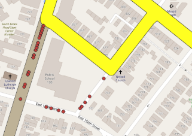

# MTA Bus Demo

This project is a demo implementation of a TimescaleDB-backed database to ingest and query real-time mass transit information from the New York Metropolitan Transportation Authority (MTA).


## Installation

* Set up PostgreSQL with TimescaleDB and PostGIS extensions.
* Install Python 3.6
* Install python dependencies with `pip install -r requirements.txt`
  - Uses Google’s GTFS realtime protobuf spec and related python lib for parsing.
  - Uses psycopg2 batch inserts for efficiency.

## Usage

First, create the database, users and tables as required. See Data Model below.

Run `python3 gtfs-ingest.py` and the script will run indefinitely, polling the MTA data feed at
regular intervals and inserting the data into our table.

The deployment-specific variables must be set as environment variables. The required
variables are:

```bash
# Obtain a key from http://bustime.mta.info/wiki/Developers/Index
export MTA_API_KEY = 'abc-123'
export MTA_CONNECTION = "host=localhost dbname=mta user=mta"
python3 gtfs-ingest.py
```

## Dataset

We’ll be using the SIRI Real-Time API and the OneBusAway "Discovery" API provided by the MTA. See http://bustime.mta.info/wiki/Developers/Index for details.

This should be generalizable to other transit systems using the General Transit Feed Specification or GTFS (see https://developers.google.com/transit/gtfs-realtime/)


## Data Model

DDL:

```sql
CREATE EXTENSION timescaledb;
CREATE EXTENSION postgis;
CREATE TABLE mta (
    vid text,
    time timestamptz,
    route_id text,
    bearing numeric,
    geom geometry(POINT, 4326));

SELECT create_hypertable('mta', 'time');

CREATE INDEX idx_mta_geom ON mta USING GIST (geom);
CREATE INDEX idx_mta_route_id ON mta USING btree (route_id);
```

### spatial data

In order to answer certain questions, we need additional geographic data from the MTA defining the bus route.
The goal is to implement a traffic anomaly detection system capable of alerting stakeholders when any bus deviates from it’s scheduled route. This information could be used to detect traffic problems in nearly real time - useful to logistics, law enforcement and transportation planners to identify traffic situations or adjust routing strategies.

* download bus routes shapefile from http://web.mta.info/developers/developer-data-terms.html#data.
* Importing the MTA bus routes with a LineString geometry.

```bash
shp2pgsql -s 4326 "NYCT Bus Routes" public.bus_routes | psql -U mta -d mta -h localhost`
```

* Buffer the route line to get a polygon for each route to add a small margin of error for point location imprecision. (+/- 0.0002 decimal degrees or ~16 meters at 45N latitude)

```sql
CREATE TABLE route_geofences AS
  SELECT route_id,
         St_buffer(St_collect(geom), 0.0002) AS geom
  FROM   bus_routes
  GROUP  BY route_id;  
```

## Queries

### Example 1: Observations over the past day where the bus deviated from the BX46 route.

```sql
SELECT
    mta.route_id AS route_id,
    mta.vid AS vehicle_id,
    mta.geom AS geom
FROM
    route_geofences AS route
    JOIN
        mta
        ON (route.route_id = mta.route_id)
WHERE mta.route_id = 'BX46'
AND NOT st_within(mta.geom, route.geom)
AND mta.TIME > Now() - INTERVAL '1 day';
```

The red dots are observations not within the route in yellow.


